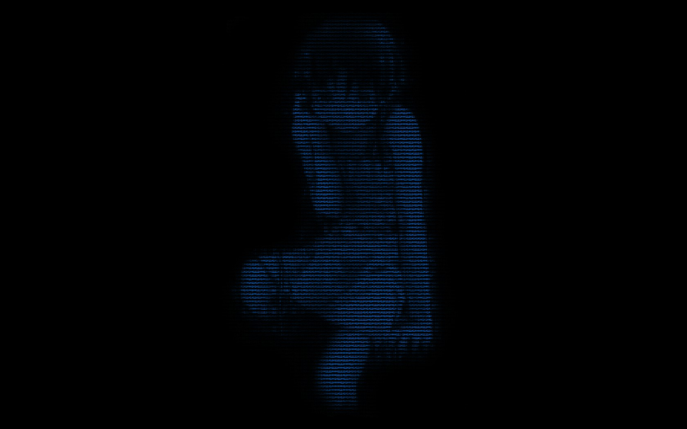

#

## Theme
Includes ly for the window manager, hyprland for the tiling manager, waybar for the top-bar/status bar, and bemenu for the app search bar.  The keybindings are similar to those of the other i3 setups with the only difference being that it used hyprland syntax. 

**Wallpaper**

